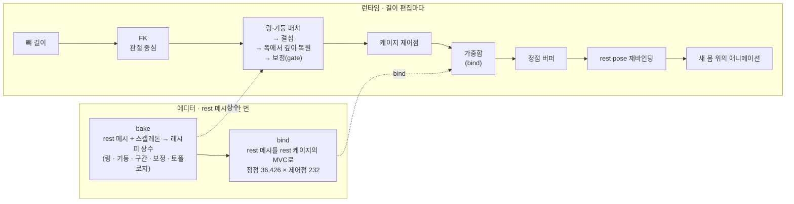

# bone-cage

[English](README.md) · **한국어**

🔗 **라이브 데모:** [wonhotoss.github.io/bone-cage](https://wonhotoss.github.io/bone-cage/) — 데스크톱 브라우저(WebGL). 체형·뼈 슬라이더, 케이지 와이어, 그 위에 몇 가지 모션.

리깅된 인체의 **뼈 길이**를 편집하면 **몸이 따라온다** — 뼈를 스케일하는 것이 아니라, **스켈레톤이
세우는 케이지**를 통해 rest 메시를 사상한다. 바뀐 몸은 다시 메시의 rest pose가 되므로, 스켈레톤에 얹는
어떤 애니메이션이든 새 몸을 변형한다.

프로젝트는 두 함수와 그 사이의 파이프라인이다.

1. **스켈레톤 → 케이지.** 관절 위치의 함수로 선언된 거친 닫힌 껍질 — 제어점 232, 삼각형 460. 사각 링
   열일곱(정수리·머리·양팔·양 팔꿈치·양 손목·척추 셋·양 무릎·양 발목·양 발볼), 정중선과 골반과 발끝의
   기둥, 손목 너머 손가락별 기둥, 고정 토폴로지. 런타임에는 현재 뼈 길이만으로 다시 세운다. 그 규칙 하나가
   [docs/cage.md](docs/cage.md)의 표 한 행이다.
2. **케이지 → 메시.** rest 메시의 각 정점을 rest 케이지의 **mean value coordinates**로 한 번 적는다
   (*bind*). 변형된 케이지는 메시를 가중합으로 되살린다. 좌표에 linear precision이 있으므로 형상의 저자는
   케이지 하나다 — 레시피가 선언한 것이 그대로 살에 도착한다.

---

## 왜 케이지인가

- **정점은 자기 주소를 지킨다.** 정점의 좌표 벡터는 케이지 안에서의 불변 주소다 — 케이지를 어떻게 고쳐도
  배꼽은 배꼽 자리에 있다. 사상 어디에도 스키닝이 없다: 스켈레톤이 케이지를 몰고 케이지가 메시를 몰기에,
  어떤 뼈 길이에서의 몸은 그 길이만의 순수 함수다.
- **두께는 물려받지 않고 선언한다.** "허벅지가 길면 굵다"는 해부학적 주장이고 부위마다 다르다. 그래서
  케이지가 링마다 그것을 선언한다(*두께 driver*: 실루엣은 뿌리 뼈를, 머리는 키를 따르고, 깊이는 자기 폭에서
  되찾는다). 좌표계에 바라는 것은 그 선언을 정직하게 옮기는 것뿐이다. 이 메시로 잰 구간→살 전달비는
  0.92~1.03이고 ×0.8·×1.2·×1.5에서 같다 — Green·Somigliana 좌표는 자기 몫의 두께를 얹으므로 MVC를 유지한
  이유다([docs/cage-deformation-plan.md](docs/cage-deformation-plan.md)).
- **애니메이션은 그 위에 얹힌다.** 사상 뒤 bind pose를 다시 구워 현재 스켈레톤에서의 스키닝이 항등이
  되게 한다. 정점 버퍼가 새 rest 몸이고, 관절 회전이 그것을 평소처럼 변형한다.

---

## 파이프라인



- **배치**(`cage.points`): 링은 앵커 관절이 자기 법선을 따라 놓고, 실루엣은 *girth* span이(사지의
  링은 그 사지의 뿌리 뼈, 머리 링은 키), 깊이는 앵커의 구간이 정한다. 기둥은 관절 중심의 아핀 결합이다.
  어떤 변과 코너는 다른 두 제어점을 잇는 선분 위에 걸리고(몸통 옆판은 겨드랑이에서 고관절로), 어떤 기둥
  끝은 그런 선분과 정중선의 교점이다.
- **복원**: 전부 놓인 뒤 구간마다 깊이를 폭/rest 폭 배로 — 깊이/폭 비가 rest의 것으로 남는다.
- **보정(gate)**: 마지막에 케이지의 한 부분을 다른 부분에 비추어 판단하는 몇 가지 — 머리는 어깨 위에,
  어깨는 머리 옆에, 허리는 고관절 위에, 무릎은 가랑이 옆에, 겨드랑이는 절두체 위에 — 각각 정점 무리를
  통째로 올리며, rest에서는 어느 것도 움직이지 않는다.
- **사상**(`cage_deform.map`): 정점마다 가중합 하나. bind(`cage_deform.bind`)가 이 방법의 비용
  전부이고 한 번만 푼다 — 데모는 그것을 구워서 싣는다.

---

## 검증

판정 둘, 둘 다 뼈 길이만의 순수 함수라 에디터에서도 헤드리스로도 돈다.

- **포함(containment)** — 사상된 모든 정점이 껍질 안에 0.5 mm 여유를 두고 있어야 한다(케이지 면 위의
  정점은 좌표 커널을 깨뜨린다).
- **자기겹침(self-collision)** — 코너를 공유하지 않는 삼각형을 뚫는 케이지 삼각형이 없어야 한다.

[tools/cage_sweep](tools/cage_sweep)는 Unity 소스를 그대로 컴파일해 슬라이더 범위 rest × [0.5, 1.5]를
네 층으로 훑는다: 본 하나씩(184), 본 쌍의 네 모서리(1,012), 무작위 전신 20,000, 체형 슬라이더 다섯의
격자 1,125. 현재: rest 0 밖 · 0 겹침, 1·2·4층 실패 0, 무작위 3층은 극단 조합 두 기전에서 414건이 열려
있다([docs/cage.md §9](docs/cage.md)).

---

## 저장소 구성

| 경로 | 내용 |
|---|---|
| [unity/Assets/Scenes/](unity/Assets/Scenes/) | 작업대. `main.unity` + `mapping_tester.cs`(인스펙터: 뼈·체형 슬라이더, 튠 슬라이더, 검사, 내보내기), `cage.cs`(bake + 런타임 배치), `cage_deform.cs`(MVC bind + map), `cage_bake.cs`(구운 파일). |
| [unity/Assets/demo/](unity/Assets/demo/) | 라이브 데모: `demo.unity`, `demo.cs`(런타임 UI Toolkit 패널, 절차적 모션), `orbit_camera.cs`, `cage_bake.bytes`(상수 + bind). |
| [tools/cage_sweep/](tools/cage_sweep/) | 헤드리스 스윕, 전달비 probe, 케이스 검사, `--bake`. |
| [docs/](docs/) | `cage.md` — 케이지 선언, 표 한 행 = 코드 선언 하나. `journal.md` — 세션별 기록. `cage-deformation-plan.md` — 좌표 방법. `index.html` + `unity/` — 호스팅되는 데모. |

환경: **Unity 6000.4.10**, **URP 17.4**, Input System 패키지. 모델은 T-pose의 Vicon actor rig, 정점
36,426, 편집 가능한 뼈 53(몸 23, 손가락 30).

---

## 데모

`Assets/demo/demo.unity`는 구운 상수와 bind를 읽어 rest 몸 옆에 슬라이더가 편집하는 두 번째 몸을
세우고, 테스터의 인스펙터를 화면에 올린다.

- **Body** — 뼈 무리를 한꺼번에 스케일하는 슬라이더 다섯: torso, arms, legs, left, right. 겹치고
  곱해진다(왼팔 = arms × left).
- **Bones** — 뼈마다 슬라이더 하나, rest 대비 비율. 손은 접힌다.
- **Cage** — 라이브 케이지의 와이어: 설계 문서가 선언한 변만, 또는 삼각화의 모든 변.
- **Motion** — rest, wave, walk, stretch, twist. 절차적이다(FBX에 클립이 없다): 관절 몇 개를 rig
  자신의 축으로 돌리므로 슬라이더가 만드는 어떤 몸에서도 같게 읽힌다. rest 몸도 같은 모션을 재생해 움직이는
  채로 둘을 비교할 수 있다.

왼쪽 드래그 회전, 오른쪽 드래그 이동, 휠 줌.

### 다시 만들기

1. **bake 갱신** — 레시피가 바뀌면. `main.unity`의 mapping tester에서 **export demo bake**를 누르거나,
   에디터를 열지 않고:
   ```
   Unity.exe -batchmode -quit -projectPath unity -executeMethod mapping_tester.export_bake_headless
   ```
   또는 스윕이 내보낸 rest 쪽에서(**export sweep data**를 먼저):
   ```
   dotnet run -c Release --project tools/cage_sweep -- --bake unity/Assets/demo/cage_bake.bytes
   ```
   파일은 약 34 MB — 정점 × 제어점마다 float 하나.
2. **빌드** — 에디터 메뉴 **Demo ▸ Build Web**, 또는
   ```
   Unity.exe -batchmode -quit -projectPath unity -executeMethod demo.build_web
   ```
   WebGL 플레이어가 `docs/unity/`에 쓰인다. 플레이어 설정은 Brotli + decompression fallback이라 GitHub
   Pages가 그대로 서빙한다.
3. **게시** — 저장소 Pages 설정에서 `main` 브랜치의 `/docs` 폴더.

---

## 한계

- **오목부.** MVC 가중치는 겨드랑이·가랑이·손가락 사이에서 음수가 된다. 그것이 드러나면 PMVC·QMVC가
  후보다 — 음수 가중치만 없애고 케이지를 유일한 저자로 남긴다.
- **전역 케이지 하나.** 케이지는 rest pose에서 세워지고 현재 포즈를 모른다. 사상이 포즈에 무관하고
  애니메이션이 재바인딩된 rest pose 위에 얹히므로 알 필요가 없다. 그래서 데모의 와이어는 사지가 아니라
  골반을 따라간다.
- **두께 driver.** 룰 여덟이 들어갔다. 남은 미결 — 무작위 3층의 두 기전, 지원할 길이 범위, 손 — 은
  [docs/cage.md §9](docs/cage.md)에 있다.

## 문서

- [docs/cage.md](docs/cage.md) — 선언: 어휘, 상수, 모든 링·기둥·구간·보정, 토폴로지, 런타임 배치, 검증, 설계 노트, 미결.
- [docs/cage-deformation-plan.md](docs/cage-deformation-plan.md) — 정점 사상: 왜 MVC인가, 무엇을 재었나, 대안은 무엇을 하는가.
- [docs/journal.md](docs/journal.md) — 여기까지 온 경위, 세션마다 한 항목.
