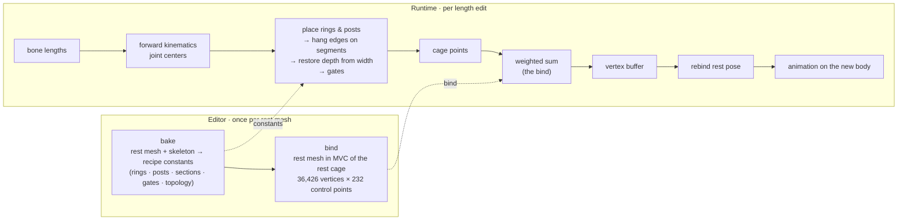

# bone-cage

**English** · [한국어](README.ko.md)

🔗 **Live demo:** [wonhotoss.github.io/bone-cage](https://wonhotoss.github.io/bone-cage/) — desktop browser (WebGL). Body and per-bone sliders, the cage wire, a few motions on top.

Resize a rigged human by editing its **bone lengths** and have the **body follow** — not by scaling
bones, but by mapping the rest mesh through a **cage that the skeleton builds**. The resized body then
becomes the mesh's rest pose, so any animation on the skeleton deforms the new body.

The project is two functions and the pipeline between them.

1. **Skeleton → cage.** A coarse closed shell — 232 control points, 460 triangles — declared as a
   function of the joint positions: seventeen rectangular rings (crown, head, arms, elbows, wrists,
   three across the spine, knees, ankles, toes), posts down the midline and through the pelvis and
   toes, and posts finger by finger past each wrist, over a fixed topology. At runtime it is rebuilt
   from the current bone lengths alone. Every rule of it is one table row in
   [docs/cage.md](docs/cage.md).
2. **Cage → mesh.** Each vertex of the rest mesh is written once in the **mean value coordinates**
   of the rest cage (the *bind*). A deformed cage rebuilds the mesh as a weighted sum. Because the
   coordinates have linear precision, the cage is the only author of the shape: what the recipe
   declares is what arrives in the flesh.

---

## Why a cage

- **A vertex keeps its address.** The coordinate vector of a vertex is its invariant place inside
  the cage — the navel stays the navel however the cage is edited. No skinning is involved anywhere
  in the mapping: the skeleton drives the cage and the cage drives the mesh, so the body at a set of
  bone lengths is a pure function of those lengths.
- **Thickness is declared, not inherited.** "A longer thigh is a thicker thigh" is an anatomical
  claim and differs by body part, so the cage declares it ring by ring (the *thickness driver*:
  silhouettes follow their root bone, the head follows the stature, depth is restored from width).
  The coordinates only have to carry the declaration faithfully. Measured on this mesh, the
  transfer ratio from a cage section to the flesh inside it is 0.92–1.03 and the same at ×0.8, ×1.2
  and ×1.5 — which is why MVC was kept over Green or Somigliana coordinates, whose
  shape-preservation would add thickness of their own
  ([docs/cage-deformation-plan.md](docs/cage-deformation-plan.md)).
- **Animation rides on top.** After a mapping the bind poses are rebound so that skinning at the
  current skeleton is the identity; the vertex buffer is the new rest body, and rotations applied
  to the joints deform it as usual.

---

## Pipeline



- **Placement** (`cage.points`): each ring is placed by its anchor joints along its own normal,
  its silhouette scaled by a *girth* span (a limb's rings follow the limb's root bone, the head
  rings the stature), its depth by the anchors' extent. Posts are affine combinations of joint
  centers. Some edges and corners hang on the segment between two other control points (the torso's
  sides run armpit to hip); some post ends are the crossing of such a segment with the midline.
- **Restore**: once everything is placed, every section's depth is scaled by its width over its
  rest width, so depth over width is what it was at rest.
- **Gates**: last, a few corrections read one part of the cage against another — the head is kept
  above the shoulders, the shoulders beside the head, the waist above the hips, the knees beside the
  crotch, the armpits above the frustum — each lifting a whole group of vertices together, and none
  acting at rest.
- **Mapping** (`cage_deform.map`): one weighted sum per vertex. The bind (`cage_deform.bind`) is
  the whole cost of the method and is solved once; the demo ships it baked.

---

## Verification

Two judgements, both pure functions of the bone lengths, so they run in the editor and headless
alike:

- **Containment** — every mapped vertex must stay inside the shell with 0.5 mm to spare (a vertex
  on a cage face breaks the coordinate kernel).
- **Self-collision** — no cage triangle may pierce another it shares no corner with.

[tools/cage_sweep](tools/cage_sweep) compiles the Unity sources themselves and walks the slider
range, rest × [0.5, 1.5], in four tiers: every bone alone (184 cases), every pair at its four
corners (1,012), 20,000 random whole bodies, and a 1,125-point grid over the five body-proportion
sliders. Current standing: rest is clean (0 outside, 0 collisions); tiers 1, 2 and 4 are clean; the
random tier has 414 open cases in two mechanisms, both extreme combinations, tracked in
[docs/cage.md §9](docs/cage.md).

---

## Repository layout

| Path | What |
|---|---|
| [unity/Assets/Scenes/](unity/Assets/Scenes/) | The bench. `main.unity` + `mapping_tester.cs` (inspector: bone and body sliders, tuning sliders, checks, exports), `cage.cs` (bake + runtime placement), `cage_deform.cs` (MVC bind + map), `cage_bake.cs` (the baked file). |
| [unity/Assets/demo/](unity/Assets/demo/) | The live demo: `demo.unity`, `demo.cs` (runtime UI Toolkit panel, procedural motions), `orbit_camera.cs`, `cage_bake.bytes` (constants + bind). |
| [tools/cage_sweep/](tools/cage_sweep/) | Headless sweep, transfer-ratio probe, case inspection, and `--bake`. |
| [docs/](docs/) | `cage.md` — the cage's declaration, one table row per code declaration (Korean). `journal.md` — the session-by-session record (Korean). `cage-deformation-plan.md` — the coordinate method (Korean). `index.html` + `unity/` — the hosted demo. |

Environment: **Unity 6000.4.10**, **URP 17.4**, Input System package. The model is a Vicon actor rig
in a T-pose, 36,426 vertices, 53 editable bones (23 body, 30 finger).

---

## The demo

`Assets/demo/demo.unity` loads the baked constants and bind, stands a second body — the one the
sliders edit — beside the rest body, and puts the tester's inspector on screen:

- **Body** — five sliders that scale groups of bones at once: torso, arms, legs, left, right. They
  overlap and multiply (a left forearm carries both *arms* and *left*).
- **Bones** — one slider per bone, as a ratio to rest; the hands fold away.
- **Cage** — the wire over the live cage: the edges the design document declares, or every edge of
  the triangulation.
- **Motion** — rest, wave, walk, stretch, twist. These are procedural (the FBX carries no clips):
  a few joints turned about the rig's own axes, so they read the same on any body the sliders make.
  The rest body plays the same motion, so the two can be compared in motion.

Left drag orbits, right drag pans, the wheel zooms.

### Rebuilding it

1. **Refresh the bake** after any change to the recipe. In `main.unity`, press **export demo bake**
   on the mapping tester; or without opening the editor:
   ```
   Unity.exe -batchmode -quit -projectPath unity -executeMethod mapping_tester.export_bake_headless
   ```
   or from the sweep's exported rest side (**export sweep data** first):
   ```
   dotnet run -c Release --project tools/cage_sweep -- --bake unity/Assets/demo/cage_bake.bytes
   ```
   The file is about 34 MB — one float per vertex per control point.
2. **Build** with **Demo ▸ Build Web** in the editor, or
   ```
   Unity.exe -batchmode -quit -projectPath unity -executeMethod demo.build_web
   ```
   which writes the WebGL player to `docs/unity/`. The player settings use Brotli with the
   decompression fallback, so GitHub Pages can serve it as is.
3. **Publish** from the `main` branch, `/docs` folder, in the repository's Pages settings.

---

## Limits

- **Concavities.** MVC weights go negative around the armpits, the crotch and between the fingers.
  Should that show, PMVC or QMVC are the candidates — they remove the negative weights and keep the
  cage as the sole author.
- **One global cage.** The cage is built in the rest pose and knows nothing of the current pose; it
  does not have to, since the mapping is pose-independent and animation rides on the rebound rest
  pose. The wire in the demo therefore follows the pelvis, not the limbs.
- **Thickness driver.** Eight rules are in; the remaining open items — the two random-tier
  mechanisms, the length range to support, the hands — are listed in
  [docs/cage.md §9](docs/cage.md).

## Documents

- [docs/cage.md](docs/cage.md) — the declaration: vocabulary, constants, every ring, post, section and gate, the topology, the runtime placement, the verification, the design notes, the open items.
- [docs/cage-deformation-plan.md](docs/cage-deformation-plan.md) — the vertex mapping: why MVC, what was measured, what the alternatives would do.
- [docs/journal.md](docs/journal.md) — how it got here, one entry per session.
